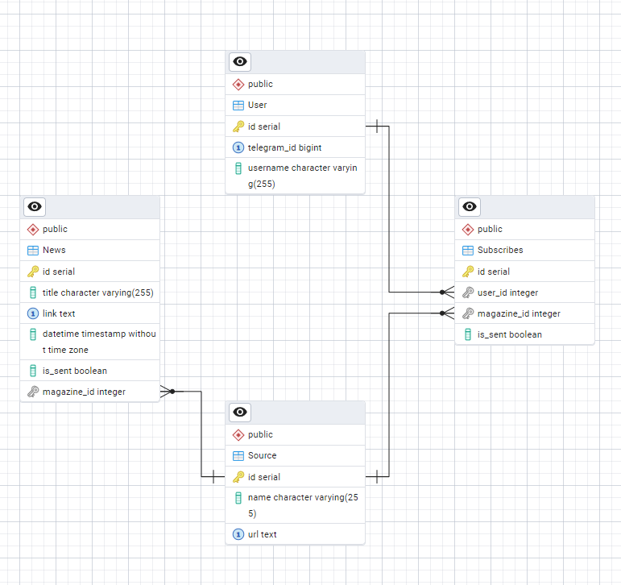
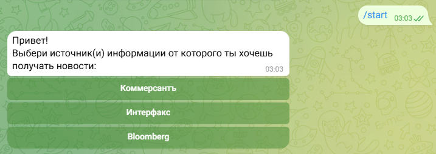
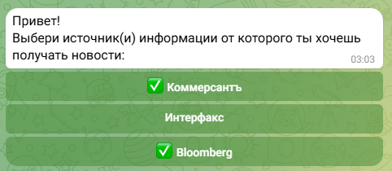
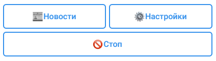
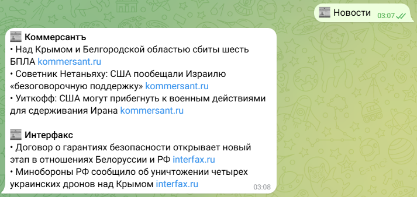
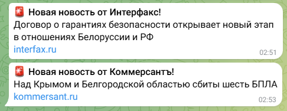

## Telegram News Bot
Проект представляет собой Telegram-бота, который собирает новости с различных источников ("Коммерсантъ", "Интерфакс", 
"Bloomberg") и рассылает их подписчикам. Бот позволяет пользователям подписываться на интересующие их источники, 
получать последние новости и управлять своими подписками.

### Основные функции
1. Парсинг новостей
Используются парсеры для каждого источника новостей.
Новости сохраняются в базу данных.

2. Рассылка новостей
Бот автоматически рассылает новые новости подписчикам.
Пользователи могут запросить последние новости вручную с помощью команды /news.

3. Управление подписками
Пользователи могут подписываться и отписываться от источников через интерактивные кнопки.
Подписки хранятся в базе данных.

4. Логирование и обработка ошибок
Все важные события и ошибки логируются для удобства отладки.

5. Интерактивные клавиатуры
Бот использует как обычные клавиатуры, так и инлайн-клавиатуры для удобства взаимодействия с пользователем.

### Технологии и зависимости
Язык программирования
Python 3.9+

### Библиотеки
telebot для работы с Telegram API.

selenium для парсинга новостей.

sqlalchemy или другая ORM для работы с базой данных.

threading для многопоточной работы (рассылка новостей и парсинг).

### База данных
PostgreSQL (или другая реляционная база данных).

### Конфигурация
Используется файл конфигурации для хранения токена бота и настроек базы данных.

Пример:
```
{
  "token": "token_api",
  "database": {
    "user": "user",
    "password" : "password",
    "dbname": "dbname",
    "host" : "host"
  }
```

# Инструкция для пользователя
1. Запуск бота.
Найдите бота в Telegram по имени и начните с ним диалог.
Используйте команду /start, чтобы начать работу.

2. Подписка на новости.
После запуска бот предложит выбрать источники новостей.
Используйте кнопки "⚙️ Настройки", чтобы управлять подписками.

3. Получение новостей.
Используйте команду /news, чтобы получить последние новости.
Новости также будут автоматически приходить, если вы подписаны на источники.

4. Остановка подписок.
Используйте кнопку "🚫 Стоп", чтобы отписаться от всех источников.


# База данных
### ERD:


# Результаты работы
### Первый запуск


### Уведомление о состоянии подписки

### Обозначение источников, на которые пользователь уже подписан

### Пользовательское меню

#### Получение последних новостей по запросу:

#### Настройка выбранных подписок

#### Отключение всех подписок


### Получение новых новостей


